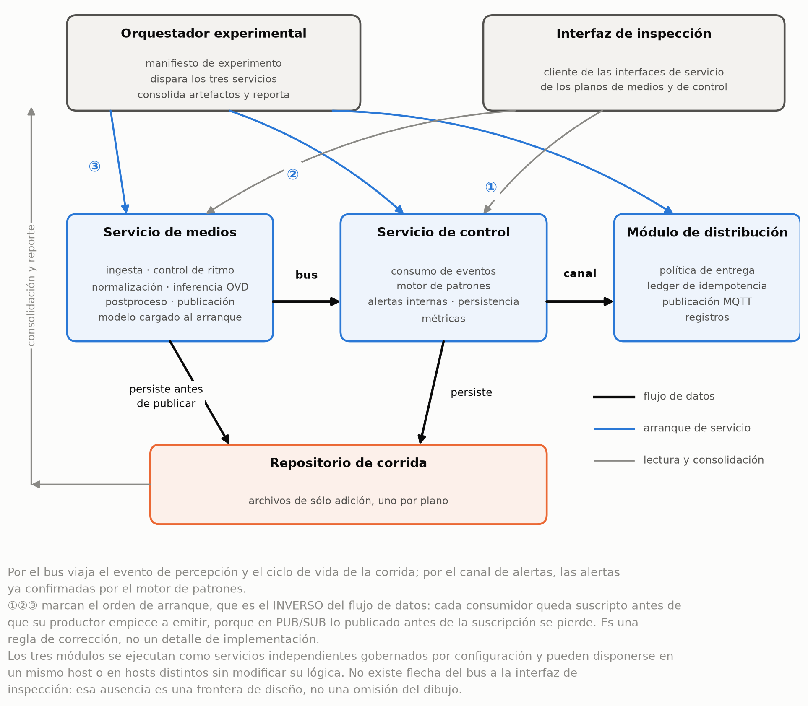

# E-OVRT-VDP — Plataforma experimental de detección open-vocabulary en video en tiempo real para monitoreo asistivo de riesgos en construcción

Proyecto Integrador · Ingeniería en Informática · IUA Córdoba, Facultad de Ingeniería · 2026
Autores: Matías Lautaro Carrizo · Gabriel Agustín Guillaumet · Simon Llamosas — Tutor: Mariano García Mattio

> **Abstract.** E-OVRT-VDP is an experimental platform that applies open-vocabulary
> detection *without training* to the assistive detection of construction-site safety
> risks, targeting two conditions — CR-01 (a person without a helmet) and CR-02 (a person
> without a safety vest) — expressed directly in natural language to the detector. Around
> it, the platform adds a temporal risk-pattern engine with per-subject identity, a
> versioned event bus, MQTT QoS 1 alert distribution, and a web console for reproducible
> experiments. It is measured on an image benchmark of 6,477 images from 3 independent
> sources and a clip bench of 47 clips with human temporal ground truth, both offline and
> under real-time constraints.

## La pregunta, y la respuesta en una línea

¿Qué rendimiento se obtiene hoy, en un entorno real de construcción civil, con detección
open-vocabulary sin entrenar, expresando las condiciones de riesgo directamente en
lenguaje natural? Y, más allá del modelo o el prompt elegidos, ¿qué aporta al resultado la
plataforma que rodea al detector — el motor de patrones temporal, la identidad por sujeto,
la distribución de alertas?

La detección zero-shot alcanza para sostener CR-01 y no alcanza para CR-02; la plataforma
alrededor del modelo cambia el resultado más que cualquier elección de modelo o de
prompt — con las mismas detecciones bit a bit, pasar de granularidad de escena a sujeto
lleva el F1 de alertas de 0,789 a 0,930 — y esa ganancia sobrevive a la restricción de
tiempo real. Las cifras, con su fuente, están en [`resultados/README.md`](resultados/README.md).

## Qué es la plataforma, en una figura

Tres servicios HTTP config-driven —medios (`:8080`), control (`:8081`) y distribución
(`:8082`)—, comunicados por dos buses de eventos versionados (detecciones y alertas), y
una consola web que orquesta experimentos reproducibles de punta a punta. Arquitectura
completa en
[`plataforma/02-arquitectura.md`](plataforma/02-arquitectura.md).

## Cómo leer este repositorio

| Si querés… | Leé |
|---|---|
| el informe completo | [`informe/`](informe/README.md) |
| entender la idea y la arquitectura en 20 minutos | [`plataforma/`](plataforma/01-problema-y-enfoque.md) — 5 documentos cortos, en orden |
| ver los resultados con su fuente | [`resultados/`](resultados/README.md) |
| ir al código | [`repositorios/`](repositorios/README.md) |
| ver la plataforma funcionando | [`evidencia/consola/`](evidencia/consola/README.md) y las [figuras](evidencia/figuras/README.md) |

## Los cinco repositorios de código

| Repositorio | Qué es | Puerto / rol |
|---|---|---|
| [e-ovrt_media-plane](https://github.com/simonll4/e-ovrt_media-plane) | servicio de inferencia open-vocabulary (FastAPI); publica `media.detection.v1` | `:8080` |
| [e-ovrt_control-plane](https://github.com/Pandulc/e-ovrt_control-plane) | motor de patrones de riesgo CR-01 / CR-02 con persistencia temporal e identidad por sujeto | `:8081` |
| [e-ovrt_alert-distribution](https://github.com/simonll4/e-ovrt_alert-distribution) | distribución de alertas confirmadas por MQTT QoS 1 con idempotencia | `:8082` |
| [e-ovrt_experimental-setup](https://github.com/simonll4/e-ovrt_experimental-setup) | prompts, manifiestos de experimento, **resultados**, consola web, deploy integral, fine-tuning | consola `:8090` |
| [e-ovrt_datasets](https://github.com/Pandulc/e-ovrt_datasets) | adquisición, conversión y curación de datasets; el banco de imágenes `bench_v3` | — |

## Cómo citar

Ver [`CITATION.cff`](CITATION.cff) — GitHub genera la referencia con el botón "Cite this
repository". Este repositorio se distribuye bajo licencia CC BY 4.0; cada repositorio de
código declara la suya en su propio archivo `LICENSE`.
