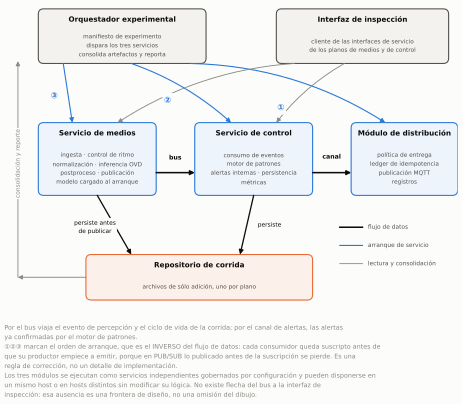

# E-OVRT-VDP

**Plataforma experimental de detección open-vocabulary en video en tiempo real para monitoreo
asistivo de riesgos en construcción**

Proyecto Integrador · Ingeniería en Informática · IUA Córdoba, Facultad de Ingeniería · 2026 
Matías Lautaro Carrizo · Gabriel Agustín Guillaumet · Simon Llamosas — Tutor: Mariano García Mattio

[Informe](informe/README.md) · [Plataforma](plataforma/01-problema-y-enfoque.md) ·
[Resultados](resultados/README.md) · [Código](repositorios/README.md) ·
[Evidencia](#evidencia-acceso-autorizado)

---

> **Abstract.** E-OVRT-VDP is an experimental platform that applies open-vocabulary
> detection *without training* to the assistive detection of construction-site safety
> risks, targeting two conditions — CR-01 (a person without a helmet) and CR-02 (a person
> without a safety vest) — expressed directly in natural language to the detector. Around
> it, the platform adds a temporal risk-pattern engine with per-subject identity, a
> versioned event bus, MQTT QoS 1 alert distribution, and a web console for reproducible
> experiments. It is measured on an image benchmark of 6,477 images from 3 independent
> sources and a clip bench of 47 clips with human temporal ground truth, both offline and
> under real-time constraints.

## La pregunta

¿Qué rendimiento se obtiene hoy, en un entorno real de construcción civil, con detección
open-vocabulary sin entrenar, expresando las condiciones de riesgo directamente en lenguaje
natural? Y, más allá del modelo o el prompt elegidos, ¿qué aporta al resultado la plataforma
que rodea al detector: el motor de patrones temporal, la identidad por sujeto, la
distribución de alertas?

## La respuesta

La detección zero-shot alcanza para sostener CR-01 y no alcanza para CR-02. La plataforma
alrededor del modelo cambia el resultado más que cualquier elección de modelo o de prompt, y
esa ganancia sobrevive a la restricción de tiempo real.

| Pregunta | Dato | Fuente |
|---|---|---|
| Qué ve el detector sin entrenar | `gdino-tiny-560`: mAP50 **0,551** sobre 6.477 imágenes de 3 fuentes; `person` y `helmet` sólidas, `vest` débil, `bare_head` sólo en el especialista | [bench_imagenes](https://github.com/simonll4/e-ovrt_experimental-setup/blob/HEAD/results/bench_imagenes/index.md) |
| Cómo expresar la condición | E-IND supera a E-DIR en los dos niveles; a Nivel B, la precisión de E-DIR (**0,146**, por debajo de 0,5) la descarta como núcleo | [bench_nivel_a](https://github.com/simonll4/e-ovrt_experimental-setup/blob/HEAD/results/bench_nivel_a/index.md) · [clip_bench](https://github.com/simonll4/e-ovrt_experimental-setup/blob/HEAD/results/clip_bench/index.md) |
| Qué agrega la plataforma | Con las mismas detecciones bit a bit, pasar de escena a sujeto lleva el F1 de alertas de **0,789 a 0,930** | [clip_bench](https://github.com/simonll4/e-ovrt_experimental-setup/blob/HEAD/results/clip_bench/index.md) |
| Qué sobrevive al tiempo real | La ganancia de la identidad **excluye el cero en las cuatro densidades** medidas (de 30 a 1,15 fps) | [realtime](https://github.com/simonll4/e-ovrt_experimental-setup/blob/HEAD/results/realtime/index.md) |

Cada cifra es el dato de una combinación bajo un protocolo, no un aprobado o un fallado. El
detalle, con `n`, material y limitaciones declaradas, está en
[`resultados/`](resultados/README.md).

## La plataforma, en una figura

<picture>
  <source media="(prefers-color-scheme: dark)" srcset="evidencia/figuras/fig-a-vista-de-procesos-oscuro.svg">
  
</picture>

Tres servicios HTTP config-driven —medios (`:8080`), control (`:8081`) y distribución
(`:8082`)— comunicados por dos buses de eventos versionados, uno de detecciones y otro de
alertas, y una consola web que orquesta experimentos reproducibles de punta a punta. Los
números marcan el orden de arranque: control, distribución y medios. La arquitectura
completa está en [`plataforma/02-arquitectura.md`](plataforma/02-arquitectura.md).

## Cómo recorrer este repositorio

| Si querés… | Andá a |
|---|---|
| entender la idea y la arquitectura en veinte minutos | [`plataforma/`](plataforma/01-problema-y-enfoque.md): cinco documentos cortos, en orden |
| ver los resultados con su fuente | [`resultados/`](resultados/README.md) |
| leer el informe | [`informe/`](informe/README.md) |
| ir al código | [`repositorios/`](repositorios/README.md) |
| ver la plataforma funcionando | [la consola](evidencia/consola/README.md) y [las figuras](evidencia/figuras/README.md) |
| ubicar cada artefacto que identifica el informe (Anexo E) | [`evidencia/mapa-de-artefactos.md`](evidencia/mapa-de-artefactos.md) |
| saber de dónde sale cada clip de video | [`evidencia/material-de-video.md`](evidencia/material-de-video.md) |
| comprobar que el código pasa sus pruebas | [`evidencia/verificacion.md`](evidencia/verificacion.md) |
| ver los videos y la evidencia cruda | [la carpeta con acceso autorizado](#evidencia-acceso-autorizado) |

## Los cinco repositorios de código

| Repositorio | Qué es | Puerto o rol |
|---|---|---|
| [e-ovrt_media-plane](https://github.com/simonll4/e-ovrt_media-plane) | servicio de inferencia open-vocabulary (FastAPI); publica `media.detection.v1` | `:8080` |
| [e-ovrt_control-plane](https://github.com/Pandulc/e-ovrt_control-plane) | motor de patrones de riesgo CR-01 / CR-02 con persistencia temporal e identidad por sujeto | `:8081` |
| [e-ovrt_alert-distribution](https://github.com/simonll4/e-ovrt_alert-distribution) | distribución de alertas confirmadas por MQTT QoS 1 con idempotencia | `:8082` |
| [e-ovrt_experimental-setup](https://github.com/simonll4/e-ovrt_experimental-setup) | prompts, manifiestos de experimento, **resultados**, consola web, deploy integral, fine-tuning | consola `:8090` |
| [e-ovrt_datasets](https://github.com/Pandulc/e-ovrt_datasets) | adquisición, conversión y curación de datasets; el banco de imágenes `bench_v3` | — |

## Evidencia: acceso autorizado

Todo lo que se puede versionar está en GitHub y se lee sin pedir nada: los índices de
resultados, los bancos congelados, la referencia temporal humana y el código. Lo que git no
guarda —los videos, los artefactos crudos de cada corrida y los checkpoints del ajuste fino—
está en una carpeta de Google Drive **con acceso autorizado**:

  <a href="https://drive.google.com/drive/folders/1LFLf3XXeZoY2zKFLfhfBB1lMT4ux4vHY?usp=sharing"><b>Carpeta de evidencia de E-OVRT-VDP</b></a> 
  acceso restringido · se solicita desde el mismo enlace

La carpeta no es pública. Para entrar hay que abrir el enlace con una cuenta de Google y
elegir **«Solicitar acceso»**; los autores aprueban cada pedido.

| Carpeta | Qué contiene |
|---|---|
| `1-ver-la-plataforma-funcionando/` | cinco videos renderizados a partir de corridas reales, que se reproducen en el navegador: una alerta que se confirma, un transitorio que no alerta y la comparación escena vs sujeto sobre el mismo clip |
| `2-banco-de-video-y-su-GT/` | los 34 clips del rodaje propio sobre los que se midieron las alertas, y la referencia temporal humana completa anotada en CVAT |
| `3-artefactos-de-resultados/` | los artefactos que respaldan cada cifra de los índices de `results/` |
| `4-fine-tuning/` | los checkpoints de los tramos T1 y T2 y sus evaluaciones contra `bench_v3`: la medición que sostiene los dos NO-GO |
| `5-datos-de-campana/` | los datos crudos de las campañas de medición |

**Lo que no está, a propósito:**

- **Los 13 clips del lote de internet.** Son recortes de videos del canal
  @HospitalConstruction, bajo la licencia estándar de YouTube; el informe declara un uso
  académico y evaluativo, con cita y sin redistribución (Anexo F). Se consiguen en su
  [lista de reproducción](https://www.youtube.com/playlist?list=PLVG3-xIaXtKzAC9JJnZJUY4aBCg0BNPKV),
  y su referencia temporal y sus métricas sí están publicadas.
- **Las imágenes de los conjuntos de terceros.** Las evaluaciones se comparten sin las
  imágenes del banco: los veredictos salen de los archivos de evaluación, y cada imagen se
  obtiene de su fuente, citada en la ficha de `bench_v3`.
- **La filmación original del rodaje**, de la que salen los 34 clips, y **los pesos
  preentrenados** de los modelos, que se descargan de su fuente original.

Cada paquete se puede verificar después de bajarlo: las huellas SHA-256 están en
[`evidencia/mapa-de-artefactos.md`](evidencia/mapa-de-artefactos.md#4-evidencia-con-acceso-autorizado).
La carpeta es el respaldo de las cifras, no su fuente: la cifra manda desde el informe
(sección y tabla) y desde `results/`.

## Cómo citar

[`CITATION.cff`](CITATION.cff) trae la referencia; GitHub la genera con el botón «Cite this
repository». Este repositorio se distribuye bajo licencia CC BY 4.0, y cada repositorio de
código declara la suya en su propio archivo `LICENSE`.
