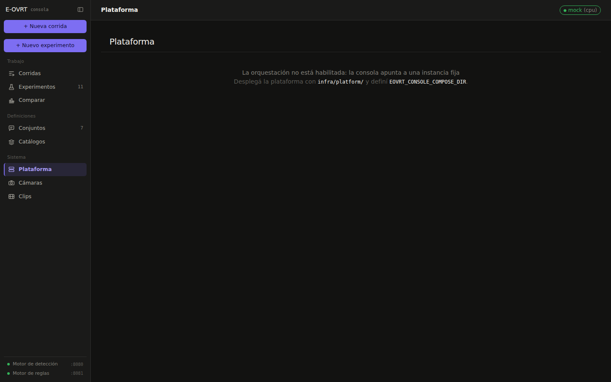
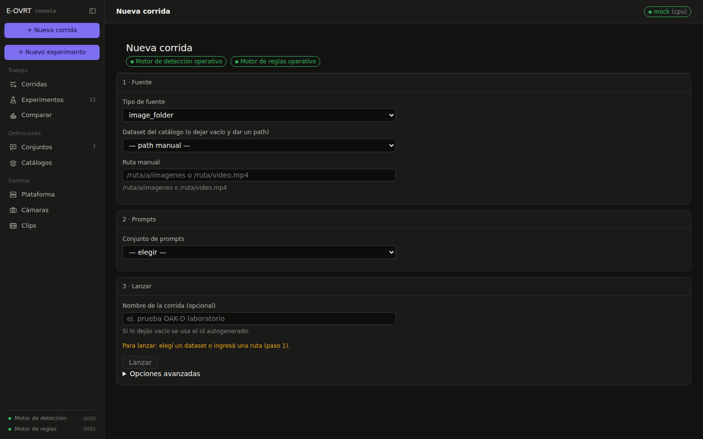
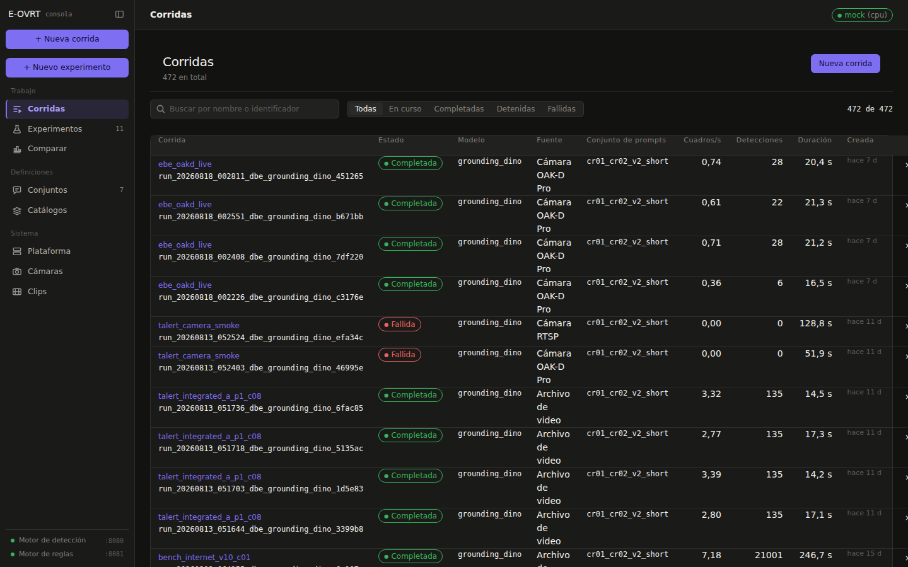
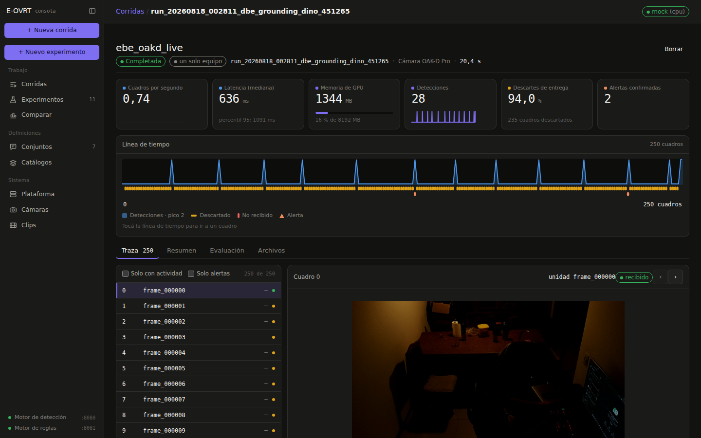
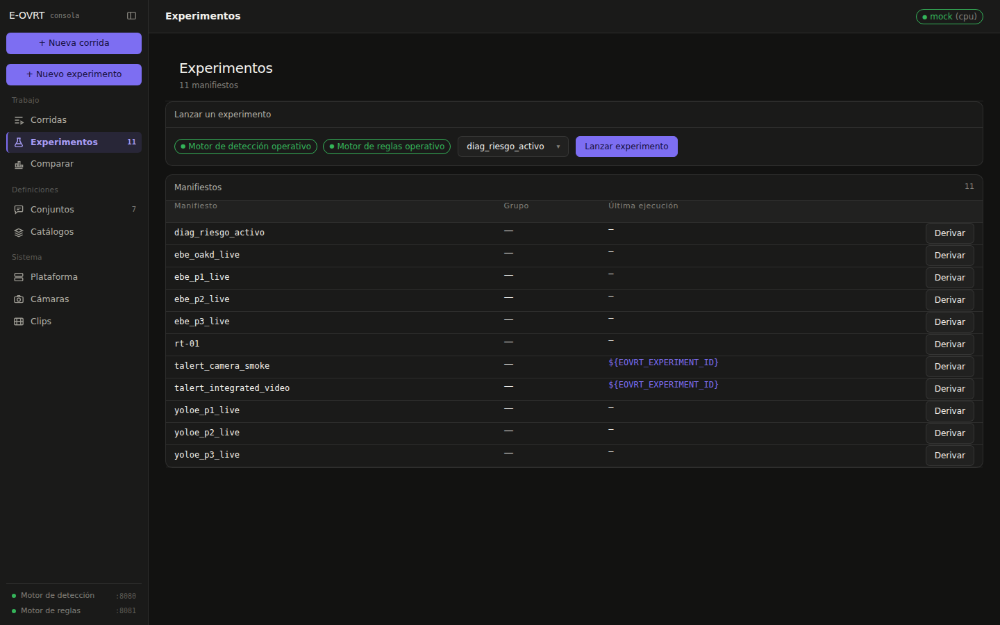
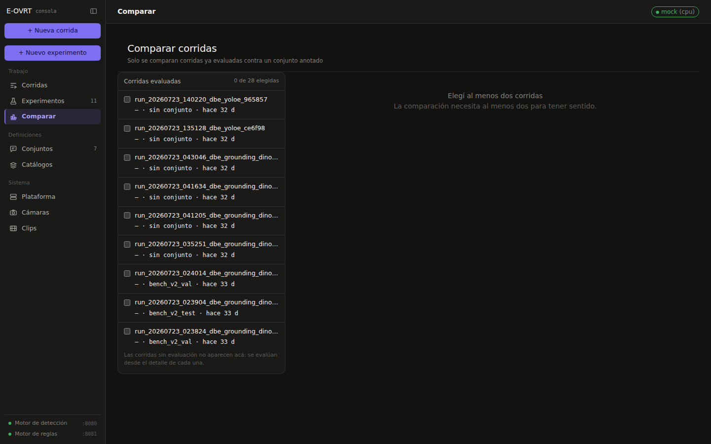
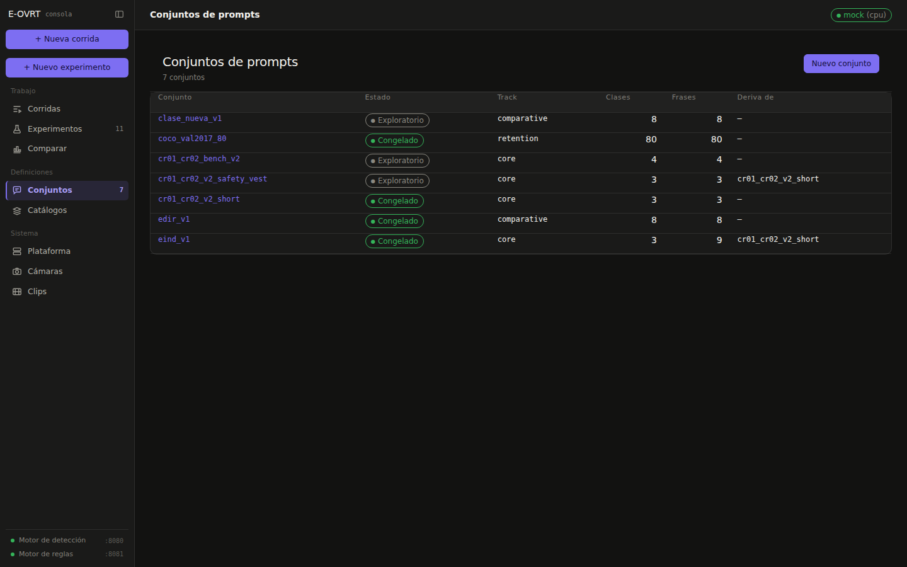

# La consola web

Capturas de la consola de `e-ovrt_experimental-setup/webconsole` (React + FastAPI), tomadas
con la plataforma completa levantada en local y el modelo `mock`, sin GPU. Los datos que se
ven son las corridas reales del repositorio. La consola es cliente HTTP de los tres
servicios: define, lanza y compara experimentos, y nunca se conecta al bus.

## Plataforma

El estado de los servicios de detección y de reglas. En esta captura la consola apunta a una
instancia fija y avisa que la orquestación de flota no está habilitada; con el deploy integral
de `infra/platform/`, esta misma pantalla enciende y apaga la flota de instancias del plano de
medios.

## Componer una corrida

Fuente, conjunto de prompts y lanzamiento. Modelo, control y distribución quedan en
«Opciones avanzadas».

## Corridas

El historial de corridas del plano de medios.

## Detalle de una corrida

Métricas, artefactos y línea de tiempo de una corrida.

## Experimentos

Los manifiestos de experimento, por referencia, y su estado. Al momento de la captura ningún
manifiesto tenía todavía una corrida asociada, así que no hay captura del detalle de un
experimento (de ahí el salto de la `05` a la `07`).

## Comparar

La comparación de corridas y de campañas.

## Conjuntos de prompts

El ciclo de vida de un conjunto de prompts: alta, edición y congelamiento.
