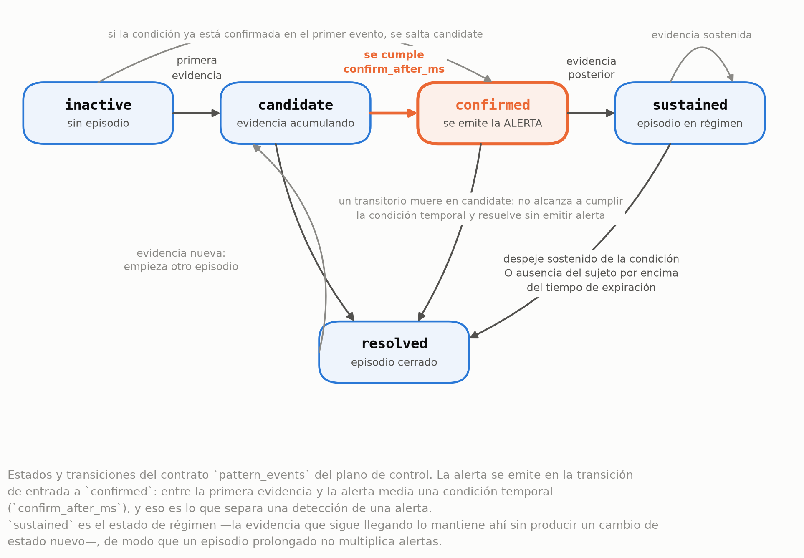
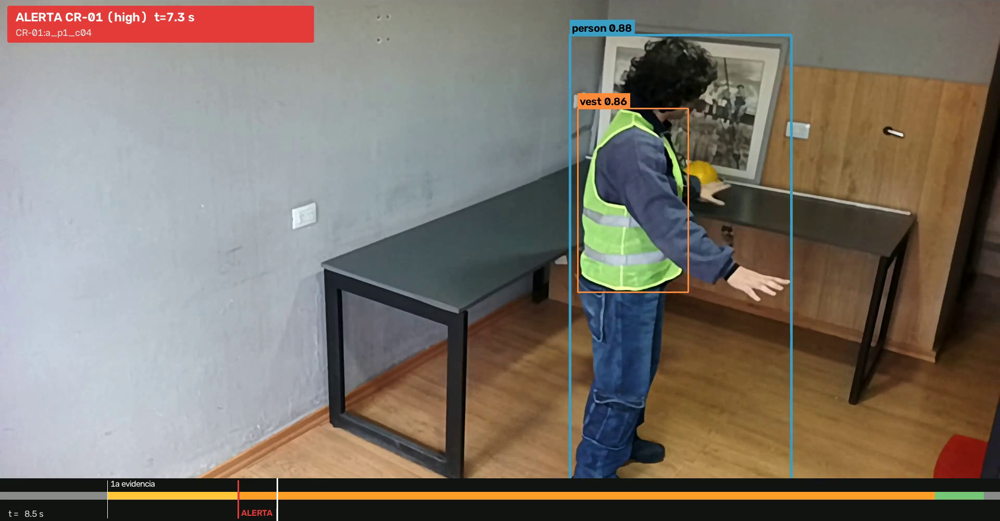

# 3 · De una detección a una alerta notificada

## Los pasos

**Detección por cuadro.** Todo empieza con un evento `media.detection.v1` que el plano
de medios emite en cada cuadro de video: cajas delimitadoras de `person`, `helmet` y
`vest` y, cuando el patrón lo requiere, de `bare_head`. Es la única salida perceptiva
del detector; todavía no hay en ella ninguna noción de riesgo.

**Evidencia por sujeto.** La condición no se evalúa sobre el cuadro entero, sino
persona por persona. Eso exige una identidad que sobreviva entre cuadros — el
`track_id` — y esa identidad la agrega el plano de control, como un decorador de la
fuente de detecciones: el contrato de percepción no cambia, sea la corrida offline o
en vivo. La plataforma mide la misma condición en dos granularidades: por escena (una
condición por cuadro, sin distinguir sujetos) y por sujeto (una condición por
persona).

**Cómo se formula la condición.** Hay dos maneras de pedirle al detector que exprese
"falta el EPP". La evidencia positiva más inferencia (E-IND) le pide que declare lo
que ve — hay una persona y no hay casco asociado a ella — y deja que el plano de
control derive la ausencia. Los prompts directos de ausencia (E-DIR) le piden
directamente algo como "bare head". La plataforma admite las dos formulaciones y
también una fusión de ambas (E-HYB); cuál rinde mejor en cada nivel se documenta en
[`resultados/`](../resultados/README.md), no en esta descripción.

**Persistencia y confirmación.** Ninguna evidencia aislada se convierte en alerta.
Cada patrón de riesgo recorre una máquina de **cinco estados** — inactivo, candidato,
confirmado, sostenido y resuelto —: una primera evidencia abre el estado candidato, y
sólo si la condición se sostiene durante la ventana de confirmación declarada
(`confirm_after_ms`, **4.000 ms para CR-01** y **7.000 ms para CR-02**) el patrón pasa
a confirmado, momento en el que se registra la alerta. Mientras la condición sigue
presente el patrón queda sostenido, sin producir una alerta nueva por cada cuadro
positivo; cuando la evidencia deja de sostenerse y se cumple la ventana de
resolución, el patrón se resuelve. Advertencia de lectura: la máquina tiene cinco
estados, y la reapertura de un episodio va del estado resuelto de vuelta a
candidato, nunca a inactivo — inactivo es sólo el punto de partida, no un destino de
retorno.

**Alerta confirmada y distribución.** Sólo la confirmación del patrón produce una
alerta. Esa alerta viaja por el bus de alertas, en el puerto `:5558`, hacia el módulo
de distribución, que la entrega por MQTT QoS 1 con dos resguardos frente a una
re-entrega: una clave de idempotencia sobre (`notification_id`, canal) y el
`alert_id` determinístico que el plano de control asigna (UUID5 sobre corrida y
sujeto), que la distribución usa para no duplicar. Advertencia
de lectura: la distribución funciona en línea, de forma continua con el resto de la
cadena — no es un lote que se procesa después.

## Qué se ve

El fotograma (t = 8,5 s) muestra al sujeto con la alerta ya confirmada a los 7,3 s
—el patrón está en estado sostenido—. Sobre el escritorio hay un casco fuera del
sujeto; no suprime la alerta porque la condición se evalúa sobre la persona.

Siguiente: [`04-escenarios-dbe-ebe.md`](04-escenarios-dbe-ebe.md)
