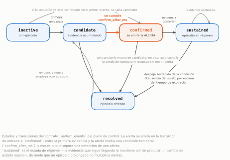
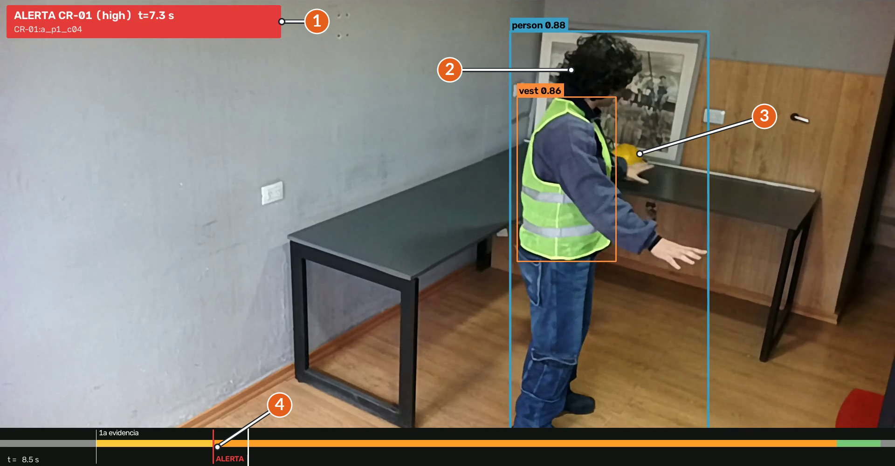

# 3 · De una detección a una alerta notificada

<picture>
  <source media="(prefers-color-scheme: dark)" srcset="../evidencia/figuras/fig-e-maquina-de-estados-oscuro.svg">
  
</picture>

**Figura E** (Figura 4.3 del informe). La máquina de cinco estados del motor de patrones y,
abajo, un episodio en el tiempo, como esquema sin escala. Si la condición ya se cumple con
el primer evento, el motor salta directo a `confirmed`, tanto al arrancar como al reabrir un
episodio desde `resolved`.

## Los pasos

**Detección por cuadro.** Todo empieza con un evento `media.detection.v1` que el plano
de medios emite en cada cuadro de video: cajas delimitadoras de `person`, `helmet` y
`vest` y, cuando el patrón lo requiere, de `bare_head`. Es la única salida perceptiva
del detector; todavía no hay en ella ninguna noción de riesgo.

**Evidencia por sujeto.** La condición no se evalúa sobre el cuadro entero, sino
persona por persona. Eso exige una identidad que sobreviva entre cuadros — el
`track_id` — y esa identidad la agrega el plano de control, como un decorador de la
fuente de detecciones: el contrato de percepción no cambia, sea la corrida offline o
en vivo. La plataforma mide la misma condición en dos granularidades: por escena (una
condición por cuadro, sin distinguir sujetos) y por sujeto (una condición por
persona).

**Cómo se formula la condición.** Hay dos maneras de pedirle al detector que exprese
"falta el EPP". La evidencia positiva más inferencia (E-IND) le pide que declare lo
que ve — hay una persona y no hay casco asociado a ella — y deja que el plano de
control derive la ausencia. Los prompts directos de ausencia (E-DIR) le piden
directamente algo como "bare head". La plataforma admite las dos formulaciones y
también una fusión de ambas (E-HYB); cuál rinde mejor en cada nivel se documenta en
[`resultados/`](../resultados/README.md), no en esta descripción.

**Persistencia y confirmación.** Ninguna evidencia aislada se convierte en alerta.
Cada patrón de riesgo recorre una máquina de **cinco estados** — inactivo, candidato,
confirmado, sostenido y resuelto —: una primera evidencia abre el estado candidato, y
sólo si la condición se sostiene durante la ventana de confirmación declarada
(`confirm_after_ms`, **4.000 ms para CR-01** y **7.000 ms para CR-02**) el patrón pasa
a confirmado, momento en el que se registra la alerta. Mientras la condición sigue
presente el patrón queda sostenido, sin producir una alerta nueva por cada cuadro
positivo; cuando la evidencia deja de sostenerse y se cumple la ventana de
resolución, el patrón se resuelve. Advertencia de lectura: la máquina tiene cinco
estados, y la reapertura de un episodio va del estado resuelto de vuelta a
candidato, nunca a inactivo — inactivo es sólo el punto de partida, no un destino de
retorno.

**Alerta confirmada y distribución.** Sólo la confirmación del patrón produce una
alerta. Esa alerta viaja por el bus de alertas, en el puerto `:5558`, hacia el módulo
de distribución, que la entrega por MQTT QoS 1 con dos resguardos frente a una
re-entrega: una clave de idempotencia sobre (`notification_id`, canal) y el
`alert_id` determinístico que el plano de control asigna (UUID5 sobre corrida y
sujeto), que la distribución usa para no duplicar. Advertencia
de lectura: la distribución funciona en línea, de forma continua con el resto de la
cadena — no es un lote que se procesa después.

## Qué se ve

**Figura C** (Figura 4.6 del informe). Un fotograma del clip `a_p1_c04` del rodaje propio,
a t = 8,5 s, con la alerta ya confirmada —el patrón está en estado sostenido—:

1. el aviso de la alerta de CR-01, de severidad alta, confirmada a los 7,3 s;
2. la persona, sobre la que se evalúa la condición: lleva chaleco y no lleva casco;
3. un casco sobre el escritorio, en cuadro pero fuera del sujeto: no suprime la alerta,
   porque la condición se evalúa sobre la persona;
4. la línea de tiempo del episodio, de la primera evidencia a la ALERTA.

---

[← 2 · Arquitectura](02-arquitectura.md) · [Inicio](../README.md) ·
[4 · Dos escenarios →](04-escenarios-dbe-ebe.md)
