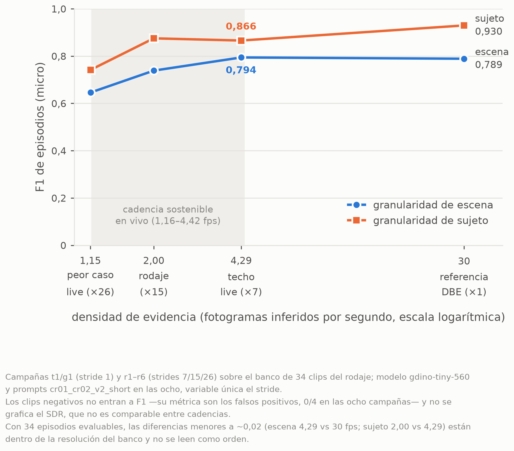
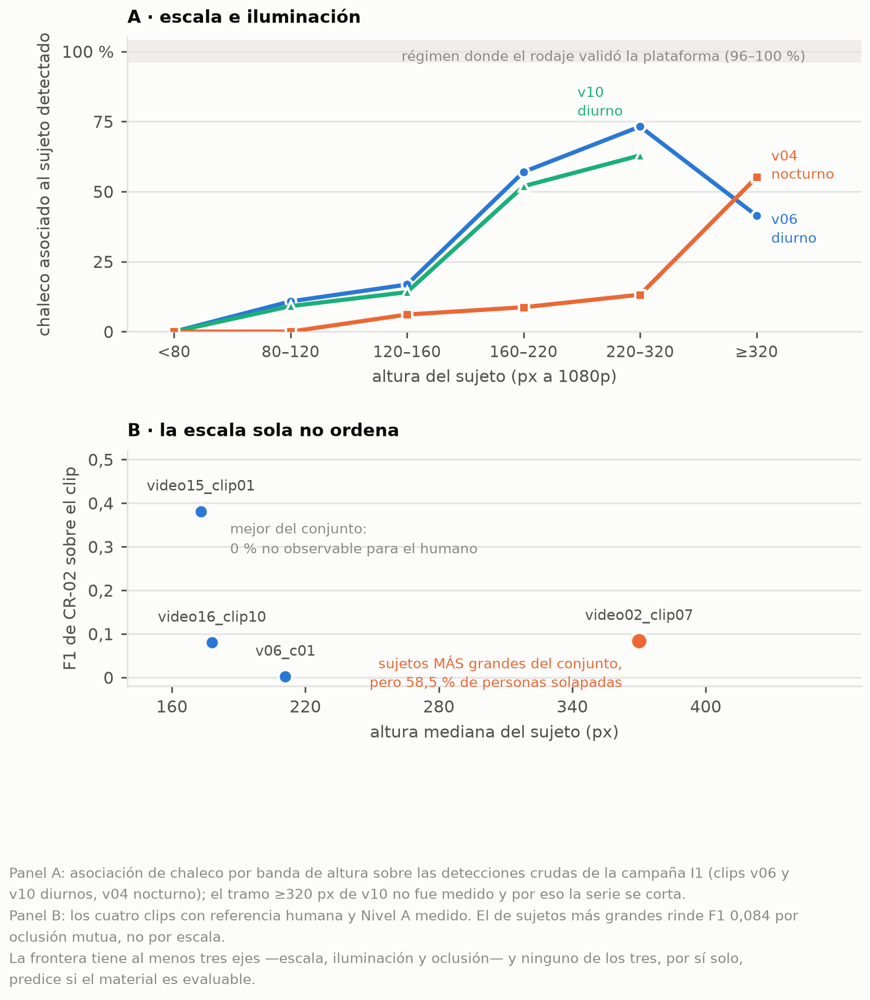

# Resultados

Cada cifra enlaza a la página de resultados de donde sale, con su `n` y su material. Los
números son el dato de una combinación bajo un protocolo, no un aprobado/fallado.

## La respuesta en cuatro números

| # | Pregunta | Dato | Fuente |
|---|---|---|---|
| 1 | Qué ve el detector sin entrenar | `gdino-tiny-560`: mAP50 **0,551** sobre 6.477 imágenes de 3 fuentes; `person`/`helmet` sólidas, `vest` débil, `bare_head` sólo en el especialista | [bench_imagenes](https://github.com/simonll4/e-ovrt_experimental-setup/blob/HEAD/results/bench_imagenes/index.md) |
| 2 | Cómo expresar la condición | E-IND supera a E-DIR en los dos niveles; a Nivel B la precisión de E-DIR **0,146** (< 0,5) la descarta como núcleo | [bench_nivel_a](https://github.com/simonll4/e-ovrt_experimental-setup/blob/HEAD/results/bench_nivel_a/index.md) · [clip_bench](https://github.com/simonll4/e-ovrt_experimental-setup/blob/HEAD/results/clip_bench/index.md) |
| 3 | Qué agrega la plataforma | Con las mismas detecciones bit a bit, escena → sujeto lleva el F1 de alertas de **0,789 a 0,930** | [clip_bench](https://github.com/simonll4/e-ovrt_experimental-setup/blob/HEAD/results/clip_bench/index.md) |
| 4 | Qué sobrevive al tiempo real | La ganancia de la identidad **excluye el cero en las cuatro densidades** medidas (30 → 1,15 fps) | [realtime](https://github.com/simonll4/e-ovrt_experimental-setup/blob/HEAD/results/realtime/index.md) |

## 1. Selección de modelo (`bench_v3`, 6.477 imágenes)

| Modelo | mAP50 `bench_v3` | mAP50 núcleo `bench_obra` (147) | recall CR-01 (n=5.313) | latencia | Fuente |
|---|---|---|---|---|---|
| `gdino-tiny-560` (campeón) | **0,551** | **0,503** | 0,308 | **129 ms** | [bench_imagenes](https://github.com/simonll4/e-ovrt_experimental-setup/blob/HEAD/results/bench_imagenes/index.md) |
| `gdino-base-560` (especialista CR-02/`bare_head`) | 0,525 | 0,474 | **0,599** | 146 ms | [bench_imagenes](https://github.com/simonll4/e-ovrt_experimental-setup/blob/HEAD/results/bench_imagenes/index.md) |

- Por estrato, campeón: `shel5k` (n=5.000) person 0,770 · helmet 0,707 · bare_head 0,133;
  `chv` (n=1.330) vest 0,553. La asimetría por clase es estructural.
  [bench_imagenes](https://github.com/simonll4/e-ovrt_experimental-setup/blob/HEAD/results/bench_imagenes/index.md)
- Resolución 560 vs 800: −24 % de latencia con igual o mejor mAP.
  [bench_imagenes](https://github.com/simonll4/e-ovrt_experimental-setup/blob/HEAD/results/bench_imagenes/index.md)

## 2. Formulación: E-IND vs E-DIR vs E-HYB

| Nivel | Combinación | F1 | Fuente |
|---|---|---|---|
| A, CR-01 `bench_obra` (n=28) | E-IND | 0,408 | [bench_nivel_a](https://github.com/simonll4/e-ovrt_experimental-setup/blob/HEAD/results/bench_nivel_a/index.md) |
| A, CR-01 `shel5k` (n=2.487) | E-IND | 0,546 | [bench_nivel_a](https://github.com/simonll4/e-ovrt_experimental-setup/blob/HEAD/results/bench_nivel_a/index.md) |
| A, CR-02 `bench_obra` (n=82) | E-IND | 0,479 | [bench_nivel_a](https://github.com/simonll4/e-ovrt_experimental-setup/blob/HEAD/results/bench_nivel_a/index.md) |
| B, clips (34 episodios evaluables) | T1 E-IND escena | **0,789** (recall 0,824 · precisión 0,757) | [clip_bench](https://github.com/simonll4/e-ovrt_experimental-setup/blob/HEAD/results/clip_bench/index.md) |
| B, clips | D1 E-DIR escena | 0,160 (precisión 0,146 → veto pre-registrado) | [clip_bench](https://github.com/simonll4/e-ovrt_experimental-setup/blob/HEAD/results/clip_bench/index.md) |
| B, clips | H1 E-HYB-or escena | 0,296 (la predicción pre-registrada de mejora se refutó) | [clip_bench](https://github.com/simonll4/e-ovrt_experimental-setup/blob/HEAD/results/clip_bench/index.md) |

## 3. Granularidad: escena vs sujeto (la palanca que más agrega)

| Campaña | Granularidad | Recall | Precisión | F1 | FP en 4 negativos | Fuente |
|---|---|---|---|---|---|---|
| T1 | escena | 0,824 | 0,757 | 0,789 | 0 | [clip_bench](https://github.com/simonll4/e-ovrt_experimental-setup/blob/HEAD/results/clip_bench/index.md) |
| **G1** | **sujeto** | **0,971** | **0,892** | **0,930** | 0 | [clip_bench](https://github.com/simonll4/e-ovrt_experimental-setup/blob/HEAD/results/clip_bench/index.md) |

- Única variable: la granularidad (SDR, tasa de detección por segmento, y TTFD, tiempo
  a la primera detección, idénticos). Δ F1 **+0,141**, IC [+0,032; +0,258].
  [clip_bench](https://github.com/simonll4/e-ovrt_experimental-setup/blob/HEAD/results/clip_bench/index.md)
- La histéresis rescata percepción intermitente (CR-02 llega a recall 1,000 con SDR 0,281)
  pero es palanca de doble filo.
  [clip_bench](https://github.com/simonll4/e-ovrt_experimental-setup/blob/HEAD/results/clip_bench/index.md)

## 4. El costo del tiempo real (densidad de evidencia)

| fps evaluados | Escena F1 | Sujeto F1 | Fuente |
|---|---|---|---|
| 30,00 (referencia) | 0,789 (T1) | 0,930 (G1) | [clip_bench](https://github.com/simonll4/e-ovrt_experimental-setup/blob/HEAD/results/clip_bench/index.md) |
| 4,29 (techo live) | 0,794 (R1) | 0,866 (R2) | [clip_bench](https://github.com/simonll4/e-ovrt_experimental-setup/blob/HEAD/results/clip_bench/index.md) |
| 2,00 (lo que corrió el rodaje) | 0,738 (R3) | 0,875 (R4) | [clip_bench](https://github.com/simonll4/e-ovrt_experimental-setup/blob/HEAD/results/clip_bench/index.md) |
| 1,15 (peor caso) | 0,646 (R5) | 0,742 (R6) | [clip_bench](https://github.com/simonll4/e-ovrt_experimental-setup/blob/HEAD/results/clip_bench/index.md) |

- En vivo: `bus_dropped_events = 0` en las 6 corridas del rodaje; fps del plano de medios
  3,75 → 4,42 (+18 %) con la optimización de arranque del plano de medios; G2A 630–890 ms
  con GDINO en vivo;
  `capture_to_host` 202–217 ms.
  [realtime](https://github.com/simonll4/e-ovrt_experimental-setup/blob/HEAD/results/realtime/index.md)

## 5. Obra real no guionada (13 clips de internet)

| | Escena | Sujeto | Fuente |
|---|---|---|---|
| F1 (2 episodios evaluables) | 0,333 | 0,190 | [clip_bench](https://github.com/simonll4/e-ovrt_experimental-setup/blob/HEAD/results/clip_bench/index.md) |
| FP sobre 11 negativos | 26 | 323 | [clip_bench](https://github.com/simonll4/e-ovrt_experimental-setup/blob/HEAD/results/clip_bench/index.md) |
| FAR/hora (0,1027 h de soak) | 29,2 | 1.850,8 | [clip_bench](https://github.com/simonll4/e-ovrt_experimental-setup/blob/HEAD/results/clip_bench/index.md) |

- Con n=2 no hay ranking posible entre granularidades; lo robusto es la asimetría de FP (12×).
  La revisión ciega del GT tumbó 5 de 7 declaraciones de episodio: la calidad del GT es un
  resultado. La figura F muestra la frontera de juzgabilidad (escala × iluminación × oclusión).

## 6. Distribución de alertas

| Tramo | p95 | n | Fuente |
|---|---|---|---|
| bus de alertas → PUBACK MQTT QoS 1 | **64,534 ms** | 460 | [t_alert_notification](https://github.com/simonll4/e-ovrt_experimental-setup/blob/HEAD/results/realtime/t_alert_notification/README.md) |
| régimen sostenido (2.ª+ entrega por corrida) | 102,025 ms | 104 | [t_alert_notification](https://github.com/simonll4/e-ovrt_experimental-setup/blob/HEAD/results/realtime/t_alert_notification/README.md) |
| primeras entregas | 49,869 ms | 356 | [t_alert_notification](https://github.com/simonll4/e-ovrt_experimental-setup/blob/HEAD/results/realtime/t_alert_notification/README.md) |

- La distribución no es el cuello: un orden de magnitud por debajo del G2A en vivo y dos por
  debajo de la persistencia deliberada del patrón (4–7 s).

## 7. Fine-tuning acotado (YOLOE-26s, jornada con protocolo pre-registrado)

| Brazo | Veredicto | Dato | Fuente |
|---|---|---|---|
| T1 | NO-GO pre-registrado | `bare_head` AP50 0,000 → 0,0455 (a 0,0045 del umbral +0,05); recall CR-01 0,0002 → 0,2089 (no llega a >0,5); retención `person` **falla** (−11,62 %, tope 10 %) | [t1_go_no_go](https://github.com/simonll4/e-ovrt_experimental-setup/blob/HEAD/finetuning/manifests/t1_go_no_go_1167640.json) |
| T2 | NO-GO pre-registrado | ganancia `bare_head` 0 → 0,0909 (sólo `shel5k`) **pasa**; retención in-domain **falla** (person −49,7 %); open-vocabulary **falla** (COCO −71,3 %) | [t2_go_no_go](https://github.com/simonll4/e-ovrt_experimental-setup/blob/HEAD/finetuning/manifests/t2_go_no_go_1167982.json) |

- Lectura: el fallo no es de capacidad sino estructural (2.946 imágenes frente a 10,35 M
  parámetros, [manifiesto T2](https://github.com/simonll4/e-ovrt_experimental-setup/blob/HEAD/finetuning/manifests/t2_go_no_go_1167982.json)).
  T1 gana por recall CR-01 y T2 por AP: no es una métrica única. El checkpoint no se
  adoptó (los brazos T1/T2 del fine-tuning no son la campaña T1 del banco de clips).

## Limitaciones declaradas (L1–L8)

| # | Limitación | Fuente |
|---|---|---|
| **L1** | FAR/hora como conteo crudo, no sostiene cota (0,27 h de negativo; harían falta 3 h) | [results/index.md](https://github.com/simonll4/e-ovrt_experimental-setup/blob/HEAD/results/index.md#limitaciones-declaradas) |
| **L2** | Sin doble anotación ni kappa (decisión declarada) | [results/index.md](https://github.com/simonll4/e-ovrt_experimental-setup/blob/HEAD/results/index.md#limitaciones-declaradas) |
| **L3** | Bordes del GT adjudicados en 6 clips por oclusión | [results/index.md](https://github.com/simonll4/e-ovrt_experimental-setup/blob/HEAD/results/index.md#limitaciones-declaradas) |
| **L4** | Medición en obra real acotada: caracteriza dónde el sistema deja de ser evaluable, no lo valida sobre obra real | [results/index.md](https://github.com/simonll4/e-ovrt_experimental-setup/blob/HEAD/results/index.md#limitaciones-declaradas) |
| **L5** | Escenarios desbalanceados ⇒ reportar por escenario y por estrato | [results/index.md](https://github.com/simonll4/e-ovrt_experimental-setup/blob/HEAD/results/index.md#limitaciones-declaradas) |
| **L6** | Tracker sin métricas MOT; en multitud real fragmenta identidades (182 con FP frente a 127 personas) | [results/index.md](https://github.com/simonll4/e-ovrt_experimental-setup/blob/HEAD/results/index.md#limitaciones-declaradas) |
| **L7** | Licencia parcial de `chv` (20,5 % del bench) | [results/index.md](https://github.com/simonll4/e-ovrt_experimental-setup/blob/HEAD/results/index.md#limitaciones-declaradas) |
| **L8** | CR-02 a Nivel A no cerrada (un estrato, IC solapados) | [results/index.md](https://github.com/simonll4/e-ovrt_experimental-setup/blob/HEAD/results/index.md#limitaciones-declaradas) |
